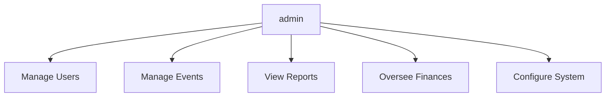
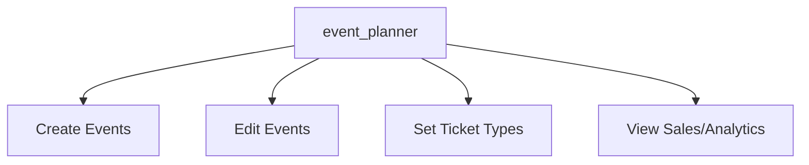
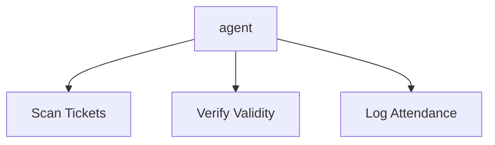
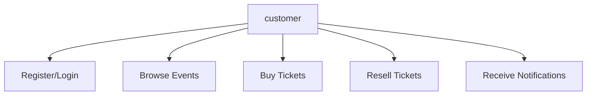

# User Roles and Flows in Smart Ticket Sales and Event Management System

This document provides a simple flowchart for each main role in the system, using the exact role names as defined in the system: `admin`, `event_planner`, `agent`, and `customer`.

---

## admin Flowchart

---

## event_planner Flowchart

---

## agent Flowchart

---

## customer Flowchart

---

**Summary Table**

| Role           | Main Responsibilities                                                                 |
|----------------|--------------------------------------------------------------------------------------|
| admin          | Manage users, events, finances, reports, system settings                             |
| event_planner  | Create/manage events, set ticket types/prices, view sales/analytics                  |
| agent          | Verify tickets at entry, scan QR codes, log attendance                               |
| customer       | Register, buy/resell tickets, manage profile, receive notifications                  | 